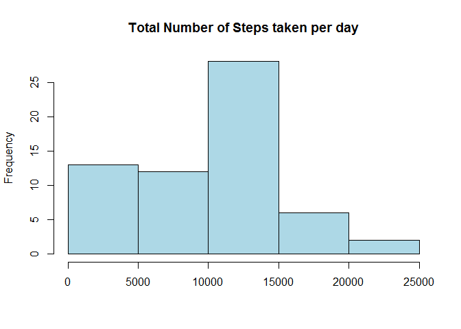
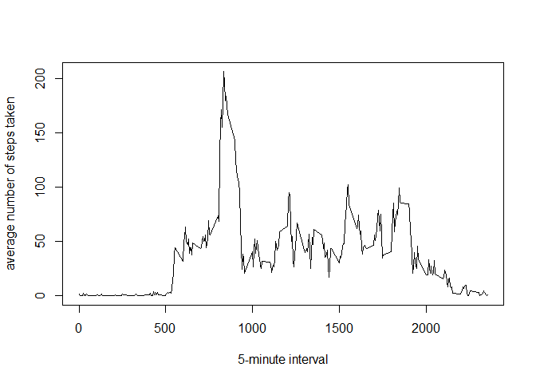
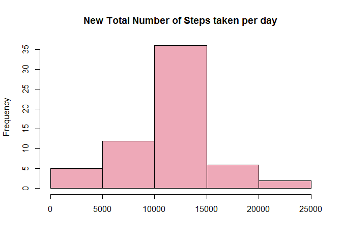

# Reproducible Research: Peer Assessment 1


## Loading and preprocessing the data

```r
data <- read.csv(unz("activity.zip", "activity.csv"), header=TRUE ,sep=",")
unlink("acitivity.zip")
```
## What is mean total number of steps taken per day?
 

```r
daytotal<- tapply(data$steps,data$date,sum,na.rm=TRUE)
hist(daytotal, main = "Total Number of Steps taken per day", xlab= "", col="lightblue")
```

 

```r
meansteps<-format(round(mean(daytotal),0),scientific = FALSE)
mediansteps<-format(round(median(daytotal),0),scientific = FALSE)
```

The mean total number of steps taken per day is 9354.  
The median total number of steps taken per day is 10395.

## What is the average daily activity pattern?

```r
intervalmean<-tapply(data$steps,data$interval,mean,na.rm=TRUE)
intervals<-as.numeric(names(intervalmean))
plot(intervals,intervalmean,type="l",xlab="5-minute interval",ylab="average number of steps taken")
```

 

```r
maxinterval<- names(intervalmean)[intervalmean ==max(intervalmean)]
```

On average across all the days in the dataset, interval 835 contains the maximum number of steps.


## Imputing missing values

```r
missing<- sum(is.na(data$steps))
```
Total number of missing values in the dataset is 2304.

If a value is missing, I will use the mean for that 5-minute interval to fill in.

```r
obs<- nrow(data)
newsteps<-numeric(obs)

for (i in 1:obs){
  if(is.na(data$steps[i]))
    newsteps[i]=as.numeric(intervalmean[as.numeric(names(intervalmean))==data$interval[i]])
  else
    newsteps[i]=data$steps[i]
}

date<-data$date
interval<-data$interval
newdata<-data.frame(newsteps,date,interval)
newdaytotal<- tapply(newsteps,date,sum)
hist(newdaytotal, main = "New Total Number of Steps taken per day", xlab= "", col="pink2")
```

 

```r
newmean<-format(round(mean(newdaytotal),0),scientific = FALSE)
newmedian<-format(round(median(newdaytotal),0),scientific = FALSE)
```
The mean total number of steps taken of the new dataset is 10766.  
The median total number of steps taken of the new dataset is 10766.   
Those values are different from the first part of the assignment. Imputing missing data increased the estimates of the total daily number of steps.


## Are there differences in activity patterns between weekdays and weekends?

```r
obs<- nrow(data)
wk<-character(obs)
for (i in 1:obs){
  if(weekdays(as.Date(date[i]))=="Sunday")
    wk[i]="weekend"
  else if (weekdays(as.Date(date[i]))=="Saturday")
    wk[i]="weekend"
  else
    wk[i]="weekday"
}

newdata<-data.frame(newdata,wk)
wk<-as.factor(wk)
weekend<-newdata[newdata$wk=="weekend",]
weekday<-newdata[newdata$wk=="weekday",]
weekendim<-tapply(weekend$newsteps,weekend$interval,mean)
weekendi<-as.numeric(names(weekendim))
weekdayim<-tapply(weekday$newsteps,weekday$interval,mean)
weekdayi<-as.numeric(names(weekdayim))
group<-as.factor(rep(c("weekend","weekday"),each=288))

wkmeans<-data.frame(rbind(cbind(as.numeric(weekendim),weekendi),cbind(as.numeric(weekdayim),weekdayi)),group)
names(wkmeans)<-c("Mean","interval","group")

library(lattice)
xyplot(wkmeans$Mean ~ wkmeans$interval | group, data = wkmeans, layout= c(1,2),type="l",xlab="Interval",ylab="Number of steps")
```

 
